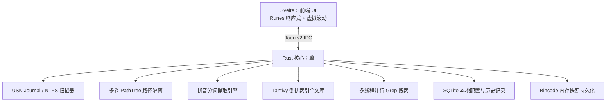

# ⚡ 凡响 (AnyEcho)

<div align="center">

**极速 · 轻量 · 现代化 · 专为 Windows 与 AI 时代打造的文件与内容全能检索利器**

[](https://www.rust-lang.org/)
[](https://tauri.app/)
[-FF3E00?logo=svelte)](https://svelte.dev/)
[](https://tailwindcss.com/)
[](LICENSE)
[-0078D6?logo=windows)](https://github.com/xiaobude/anyecho)

[简体中文](README.md) | [English](#english-summary)

</div>

---

## 🌟 为什么选择「凡响 AnyEcho」？

**凡响 (AnyEcho)** 是一款基于 **Tauri v2 + Svelte 5 + Rust** 构建的下一代 Windows 桌面超级搜索工具。不仅拥有媲美 Everything 的底层 NTFS USN Journal 毫秒级全盘扫描能力，更针对 **AI 时代大模型资产管理**、**中文全拼/首字母检索**、**全文内容即时 Grep** 以及 **极致单文件体积优化** 进行了深度重构与打磨。

---

## ✨ 核心特性

- 🚀 **毫秒级 NTFS USN Journal 极速扫描**
  - 直接遍历 Windows NTFS 底层 USN 日志，百万级文件全盘初次索引耗时 **< 2 秒**。
  - 支持非管理员（普通权限）无感降级遍历与跨卷容错。
- ⚡ **瞬时冷启动快照 (`index_cache.bin`)**
  - 自动持久化高性能二进制内存快照，下次打开程序仅需 **~80ms** 即可瞬间就绪，无需每次重新扫描全盘。
- 🤖 **专属 AI 大模型与权重文件分类**
  - 内置 AI 专属筛选器，一键过滤与秒级定位大模型权重：`.gguf`, `.safetensors`, `.pt`, `.pth`, `.onnx`, `.nvfp4`, `.fp8`, `.awq`, `.gptq`, `.ggml`, `.bin`, `.ckpt` 等。
- 🔤 **全智能中文拼音检索**
  - 原生支持 **汉字 / 全拼 / 首字母缩写** 实时模糊检索（例如：输入 `fx` 秒搜 `凡响`，输入 `dsk` 搜 `Desktop`）。
- 📝 **双模式内容检索**
  - **即时 Grep 检索**：利用多线程并行流式扫描文件内容，关键词命中即时流式输出。
  - **知识库倒排检索**：基于 Tantivy 引擎对指定目录建立倒排索引，支持大规模代码与文档毫秒级全文检索。
- 📊 **可调整列宽 & 60FPS 虚拟长列表**
  - 虚拟列表技术支撑数百万条结果丝滑滚动，零内存暴涨。
  - 表格表头支持**鼠标拖拽自由调整列宽**（序号、名称、扩展名类型、路径、大小、修改日期）。
- 📏 **精准文件属性与大小展示**
  - 视口数据并行动态补全真实文件大小（如 `14.2 GB`, `3.5 MB`, `0 B`）及 `<DIR>` 目录标识。
- 🌐 **双语国际化 (i18n)**
  - 界面原生支持 **中文 / 英文 (English)** 实时一键切换，语言设置自动记忆。
- 🪶 **8MB 极限瘦身纯绿色单文件**
  - 借助全依赖 LTO、代码剥离、LLVM `opt-level = "z"` 极致体积优化，完整发行版仅 **8.07 MB**。
  - 静态内嵌 SQLite、Tantivy 与前端资源，**单个 `.exe` 即拷即用，零外部依赖**。

---

## 📸 界面预览

```
┌────────────────────────────────────────────────────────────────────────┐
│ ⚡ 凡响 AnyEcho    [ 🔍 搜索文件名 / 拼音 (如: fx, ext:pdf, size:>10MB) ]  🌐 EN │
├────────────────────────────────────────────────────────────────────────┤
│ [全部] [🤖 AI模型/权重] [📁 文件夹] [📄 文档] [🖼️ 图片] [🎬 视频] [🎵 音频] [⚡ 程序]  │
├────────────────────────────────────────────────────────────────────────┤
│ #  │ 名称                   │ 类型   │ 路径              │ 大小    │ 修改日期     │
├────┼────────────────────────┼────────┼───────────────────┼─────────┼──────────────┤
│ 1  │ 🤖 Qwen2.5-7B.gguf     │ GGUF   │ D:\AI\models      │ 4.68 GB │ 2026-08-15   │
│ 2  │ 📘 架构设计说明书.docx   │ DOCX   │ C:\Users\Docs     │ 1.25 MB │ 2026-08-20   │
│ 3  │ 📁 anyecho             │ 文件夹 │ C:\AI\anyecho     │ <DIR>   │ 2026-09-01   │
└────────────────────────────────────────────────────────────────────────┘
```

---

## ⌨️ 快捷键速查

| 快捷键 | 功能说明 |
| :--- | :--- |
| `Alt + Space` | 全局快捷唤醒 / 隐藏主窗口（类似 Spotlight） |
| `↓` / `↑` | 在搜索结果列表或历史建议中上下选择 |
| `Enter` | **在列表中**：打开选中的文件<br>**在输入框中**：确认搜索并收起建议下拉（不误开文件） |
| `Shift + Enter` | 在 Windows 资源管理器中打开并定位选中文件 |
| `Ctrl + C` | 复制选中文件的完整绝对路径到剪贴板 |
| `Esc` | 优先关闭搜索历史建议；再次按下清空输入框或隐藏窗口 |
| 鼠标双击 | 直接打开目标文件或运行程序 |
| 鼠标右键 | 呼出功能菜单（打开、定位、复制路径、收藏等） |

---

## 🛠️ 技术架构



* **前端 (Frontend)**:
  * [Tauri v2](https://tauri.app/) - 超轻量、低内存占用的原生渲染管线
  * [Svelte 5 (Runes)](https://svelte.dev/) - 编译期无虚拟 DOM 的极致响应式框架
  * [Tailwind CSS](https://tailwindcss.com/) - 极简暗黑毛玻璃现代 UI
  * [Virtual List](src/lib/components/VirtualList.svelte) - 支撑百万级行数据的虚拟化视口
* **后端 (Backend / Rust)**:
  * `winapi` / Windows API - 深度集成 NTFS `FSCTL_ENUM_USN_DATA` 底层调用
  * `rayon` - 全核并行流式检索与元数据补全
  * `tantivy` - 纯 Rust 高性能全文检索引擎
  * `pinyin` - 中文拼音分词与缩写提取
  * `rusqlite (bundled)` - 零配置静态内嵌 SQLite 数据库
  * `bincode` - 毫秒级二进制快照序列化

---

## 📦 编译与本地运行

### 前置要求
1. [Node.js](https://nodejs.org/) (v18+)
2. [Rust / Cargo](https://www.rust-lang.org/tools/install) (1.78+)
3. Windows 10/11 操作系统及 WebView2（系统自带）

### 1. 克隆代码
```bash
git clone https://github.com/xiaobude/anyecho.git
cd anyecho
```

### 2. 安装前端依赖
```bash
npm install
```

### 3. 本地开发调试
```bash
npm run tauri dev
```

### 4. 生产打包（生成极致瘦身单文件与安装包）
```bash
npm run tauri build
```
编译产物：
* **绿色便携单文件**：`src-tauri/target/release/anyecho.exe` (~8 MB)
* **标准 Windows 安装包**：`src-tauri/target/release/bundle/nsis/凡响 AnyEcho_0.1.0_x64-setup.exe`

---

<a name="english-summary"></a>

## 🌐 English Summary

**AnyEcho** is a blazing-fast, lightweight, and modern desktop search tool for Windows, powered by **Tauri v2 + Svelte 5 + Rust**.

### Highlights
- ⚡ **Sub-second NTFS USN Journal Indexing**: Indices millions of files in under 2 seconds.
- 💾 **Instant Snapshot Cold Boot**: Pre-built memory cache loads in ~80ms on startup.
- 🤖 **Dedicated AI Weights Filter**: Filter `.gguf`, `.safetensors`, `.onnx`, `.pt`, `.nvfp4`, etc.
- 🔤 **Chinese Pinyin Search**: Instant acronym & full pinyin fuzzy matching.
- 🔍 **Dual Content Search**: Parallel grep & Tantivy-based full-text semantic knowledge base.
- 🪶 **Ultra-compact Standalone Binary**: 8MB single `.exe` with zero external dependencies.
- 🌐 **Full i18n**: Instant English & Chinese language switching.

---

## 📄 开源许可证 (License)

本项目基于 [MIT License](LICENSE) 开源。欢迎提交 Issue 与 Pull Request！
