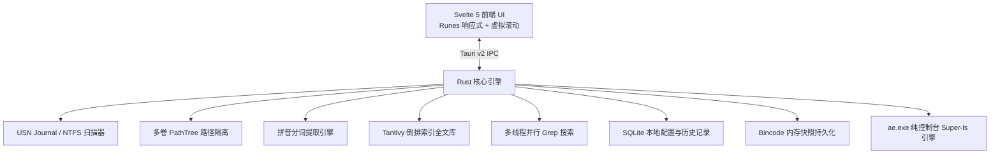

# ⚡ 凡响 (AnyEcho)

<div align="center">

**极速 · 轻量 · 现代化 · 专为 Windows 与 AI 时代打造的文件与内容全能检索利器**

[](https://www.rust-lang.org/)
[](https://tauri.app/)
[-FF3E00?logo=svelte)](https://svelte.dev/)
[](https://tailwindcss.com/)
[](LICENSE)
[-0078D6?logo=windows)](https://github.com/xiaobude/anyecho)

[简体中文](README.md) | [English](#english-summary)

</div>

---

## 🌟 为什么选择「凡响 AnyEcho」？

**凡响 (AnyEcho)** 是一款基于 **Tauri v2 + Svelte 5 + Rust** 构建的下一代 Windows 桌面超级搜索利器与终端工具。不仅拥有媲美 Everything 的底层 NTFS USN Journal 毫秒级全盘扫描能力，更针对 **AI 时代大模型资产管理**、**中文全拼/首字母模糊检索**、**高级正则表达式**、**全文内容即时 Grep** 以及 **超级 `ls` 终端增强** 进行了深度重构与打磨。

---

## ✨ 核心特性

- 🚀 **毫秒级 NTFS USN Journal 极速扫描**
  - 直接遍历 Windows NTFS 底层 USN 日志，百万级文件全盘初次索引耗时 **< 2 秒**。
  - 支持非管理员（普通权限）无感降级遍历与跨卷隔离容错。
- ⚡ **瞬时冷启动快照 (`index_cache.bin`)**
  - 自动持久化高性能二进制内存快照，下次打开程序仅需 **~80ms** 即可瞬间就绪，无需每次重新扫描全盘。
- 🤖 **专属 AI 大模型与权重文件分类**
  - 内置 AI 专属筛选器，一键秒级定位大模型权重：`.gguf`, `.safetensors`, `.pt`, `.pth`, `.onnx`, `.nvfp4`, `.fp8`, `.awq`, `.gptq`, `.ggml`, `.bin`, `.ckpt` 等。
- 🔤 **全智能中文拼音检索**
  - 原生支持 **汉字 / 全拼 / 首字母缩写** 实时模糊检索（例如：输入 `fx` 秒搜 `凡响`，输入 `dsk` 搜 `Desktop`）。
- 🎯 **强大的正则表达式与多条件组合检索**
  - 支持标准正则表达式（`regex:` / `r:`）、扩展名语法、大小区间、通配符以及多关键字并集查询。
- 💻 **内置 `ae` 超级终端命令行（Super-ls + 全局搜索）**
  - **不带参数**：充当现代化超级 `ls`，展示图标、大写类型、易读大小、时间及目录总空间统计。
  - **带搜索词**：瞬间切换为毫秒级全盘搜索引擎，支持管道与 JSON 输出。
- 📝 **双模式全文内容检索**
  - **即时 Grep 检索**：利用多线程并行流式扫描文件内容，关键词命中即时流式输出。
  - **知识库倒排检索**：基于 Tantivy 引擎对指定目录建立倒排索引，支持大规模代码与文档毫秒级全文检索。
- 📊 **可调整列宽 & 60FPS 虚拟长列表**
  - 虚拟列表技术支撑数百万条结果丝滑滚动，零内存暴涨。
  - 表格表头支持**鼠标拖拽自由调整列宽**（序号、名称、扩展名类型、路径、大小、修改日期）。
- 📏 **精准文件属性与大小展示**
  - 视口数据并行动态补全真实文件大小（如 `14.2 GB`, `3.5 MB`, `0 B`）及 `<DIR>` 目录标识。
- 🌐 **双语国际化 (i18n)**
  - 界面原生支持 **中文 / 英文 (English)** 实时一键切换，语言设置自动记忆。
- 🪶 **8MB 极限瘦身纯绿色单文件**
  - 借助全依赖 LTO、代码剥离、LLVM `opt-level = "z"` 极致体积优化，完整发行版仅 **8.15 MB**，CLI 伴侣仅 **2.74 MB**。

---

## 🔍 搜索查询语法与正则表达式速查

凡响 AnyEcho 在桌面搜索框与终端 `ae` 命令行中支持极其丰富的高级过滤、类别筛选与正则语法：

| 语法类型 | 查询示例 | 说明与匹配行为 |
| :--- | :--- | :--- |
| **多关键字并集** | `qwen 27b` | 同时包含 `qwen` 和 `27b` 的文件（空格分隔） |
| **中文全拼 / 缩写** | `fx` 或 `fanxiang` | 智能匹配包含汉字 **「凡响」** 的文件或文件夹 |
| **拼音组合检索** | `type:doc chengjian` | 在文档大类中，按拼音秒搜 **「王承建 简历」** 等相关文件 |
| **正则表达式** | `regex:^qwen.*\.gguf$` | 匹配以 `qwen` 开头且扩展名为 `.gguf` 的文件 |
| **正则表达式缩写** | `r:(nvfp4\|fp8\|awq)` | 匹配名称中含有 `nvfp4`、`fp8` 或 `awq` 的任意文件 |
| **日期正则匹配** | `regex:\d{4}-\d{2}-\d{2}` | 匹配文件名中含有 `2026-09-01` 格式日期的文件 |
| **扩展名指定** | `ext:pdf` 或 `ext:docx;xlsx` | 仅检索指定扩展名的文件 |
| **文件大小区间** | `size:>10MB` / `size:<500KB` / `size:1GB-5GB` | 精准匹配指定容量大小范围内的文件 |
| **路径限定搜索** | `D:\AI\` 或 `path:models` | 仅在指定驱动器或指定路径树下进行搜索 |
| **通配符模糊匹配** | `*qwen*.gguf` 或 `IMG_2026???.jpg` | 使用 `*` 与 `?` 通配符进行匹配 |
| **全文内容检索** | `content:nvfp4` | 进入内容检索模式，多线程实时扫描文件正文内容 |

### 📂 类别筛选宏指令 (`type:` / `kind:`)

支持在关键词前后任意添加分类语法，系统会自动将其映射到对应的扩展名集合：

| 类别指令 | 快捷别名 | 涵盖格式与范围 | 查询示例 |
| :--- | :--- | :--- | :--- |
| **`type:doc`** | `doc:`, `kind:doc`, `docs:` | 文档格式 (`.doc`, `.docx`, `.pdf`, `.txt`, `.md`, `.xls`, `.xlsx`, `.csv`, `.ppt`, `.pptx`, `.wps`, `.rtf`, `.odt`, `.epub`, `.log`, `.tex`) | `type:doc 承建` |
| **`type:ai`** | `ai:`, `kind:ai`, `model:` | AI 模型与权重 (`.gguf`, `.safetensors`, `.pt`, `.pth`, `.onnx`, `.bin`, `.ckpt`, `.tflite`, `.engine`, `.trt`, `.nvfp4`, `.fp8`, `.awq`, `.gptq`) | `type:ai qwen` |
| **`type:image`** | `pic:`, `kind:image`, `img:` | 图片格式 (`.png`, `.jpg`, `.jpeg`, `.gif`, `.webp`, `.svg`, `.ico`, `.bmp`, `.tiff`, `.psd`, `.raw`, `.heic`) | `type:pic 截图` |
| **`type:video`** | `video:`, `kind:video`, `movie:` | 视频媒体 (`.mp4`, `.mkv`, `.avi`, `.mov`, `.wmv`, `.flv`, `.webm`, `.m4v`, `.rmvb`, `.ts`) | `type:video 2026` |
| **`type:audio`** | `audio:`, `kind:audio`, `music:` | 音频音乐 (`.mp3`, `.flac`, `.wav`, `.aac`, `.ogg`, `.m4a`, `.wma`, `.ape`, `.mid`) | `type:audio live` |
| **`type:code`** | `code:`, `kind:code`, `src:` | 源代码工程 (`.rs`, `.ts`, `.js`, `.py`, `.c`, `.cpp`, `.go`, `.java`, `.html`, `.css`, `.svelte`, `.vue`, `.json`, `.sql`, `.sh`, `.bat`, `.ps1`) | `type:code main` |
| **`type:app`** | `app:`, `kind:app`, `exe:` | 可执行与应用 (`.exe`, `.msi`, `.bat`, `.cmd`, `.ps1`, `.lnk`, `.vbs`, `.jar`) | `type:app chrome` |
| **`type:archive`** | `zip:`, `kind:archive`, `rar:` | 压缩包归档 (`.zip`, `.rar`, `.7z`, `.tar`, `.gz`, `.bz2`, `.xz`, `.iso`, `.cab`) | `type:archive backup` |
| **`type:folder`** | `dir:`, `folder:`, `kind:dir` | 仅文件夹与目录 | `type:folder models` |
| **`type:file`** | `file:`, `kind:file` | 仅普通文件（排除文件夹） | `type:file config` |


---

## 💻 `ae` 超级终端命令行使用指南

凡响自带独立的轻量控制台伴侣 **`ae.exe`**（约 2.7MB，已自动部署至系统 Path），无缝融合了 **超级 `ls` 目录统计** 与 **全盘毫秒级搜索**：

### 1. 超级 `ls` 模式（查看当前或指定目录）
不带参数或指定目录路径时，自动以现代结构化表格展开文件列表，带语义图标、真实大小与统计汇总：

```powershell
# 列出当前目录
ae

# 列出指定子目录或外部目录
ae src
ae ..
ae D:\AI
```

实测终端输出效果：
```text
PS C:\AI\anyecho> ae

📂 目录: C:\AI\anyecho
========================================================================================
#    类型       大小         修改时间                 名称
----------------------------------------------------------------------------------------
1    DIR      <DIR>      2026-09-01 23:59:54  📁 .git
2    DIR      <DIR>      2026-09-01 23:57:35  📁 dist
3    DIR      <DIR>      2026-09-01 18:30:36  📁 node_modules
4    DIR      <DIR>      2026-09-01 21:25:34  📁 src
5    DIR      <DIR>      2026-09-01 19:29:18  📁 src-tauri
6    GITIGNORE 327 B      2026-09-01 23:36:53  📄 .gitignore
7    HTML     336 B      2026-09-01 18:23:18  💻 index.html
8    -        1.0 KB     2026-09-01 23:37:25  📄 LICENSE
9    JSON     90.9 KB    2026-09-01 18:24:22  ⚙️ package-lock.json
10   JSON     647 B      2026-09-01 18:30:29  ⚙️ package.json
11   MD       14.0 KB    2026-09-01 18:18:30  📝 Plan.md
12   JS       81 B       2026-09-01 18:23:06  💻 postcss.config.js
13   MD       8.6 KB     2026-09-01 23:37:20  📝 README.md
14   JS       116 B      2026-09-01 18:23:05  💻 svelte.config.js
15   JS       158 B      2026-09-01 18:23:05  💻 tailwind.config.js
16   JSON     355 B      2026-09-01 18:23:04  ⚙️ tsconfig.json
17   TS       426 B      2026-09-01 18:23:05  💻 vite.config.ts
----------------------------------------------------------------------------------------
📊 共计: 📁 5 个目录, 📄 12 个文件 (总大小: 116.9 KB)
```

---

### 2. 全盘超级搜索模式（带查询参数）
输入关键词即刻进入毫秒级全局检索：

```powershell
# 基础模糊搜索
ae qwen3.8-27b

# AI 大模型权重检索
ae type:ai nvfp4

# 全文文本内容搜索 (支持 c: 或 content:，包含空格用引号包裹)
ae c:"父亲和儿子"

# 组合过滤：在文档或指定路径中检索特定文本内容
ae type:doc *.txt c:"父亲和儿子"
ae "D:\AI\*.md" content:"llama"

# 正则表达式检索
ae "regex:^qwen.*\.gguf$"

# 限制显示条数
ae qwen -n 10

# 纯绝对路径输出（便于 PowerShell 管道流水线处理）
ae type:ai qwen3.8-27b -p | Select-String "nvfp4"

# JSON 格式输出（便于外部脚本解析）
ae qwen --json

```

---

## ⌨️ 快捷键速查

| 快捷键 | 功能说明 |
| :--- | :--- |
| `Alt + Space` | 全局快捷唤醒 / 隐藏主窗口（类似 Spotlight） |
| `↓` / `↑` | 在搜索结果列表或历史建议中上下选择 |
| `Enter` | **在列表中**：打开选中的文件<br>**在输入框中**：确认搜索并收起建议下拉（不误开文件） |
| `Shift + Enter` | 在 Windows 资源管理器中打开并定位选中文件 |
| `Ctrl + C` | 复制选中文件的完整绝对路径到剪贴板 |
| `Esc` | 优先关闭搜索历史建议；再次按下清空输入框或隐藏窗口 |
| 鼠标双击 | 直接打开目标文件或运行程序 |
| 鼠标右键 | 呼出功能菜单（打开、定位、复制路径、收藏等） |

---

## 🛠️ 技术架构



* **前端 (Frontend)**:
  * [Tauri v2](https://tauri.app/) - 超轻量、低内存占用的原生渲染管线
  * [Svelte 5 (Runes)](https://svelte.dev/) - 编译期无虚拟 DOM 的极致响应式框架
  * [Tailwind CSS](https://tailwindcss.com/) - 极简暗黑毛玻璃现代 UI
  * [Virtual List](src/lib/components/VirtualList.svelte) - 支撑百万级行数据的虚拟化视口
* **后端 (Backend / Rust)**:
  * `winapi` / Windows API - 深度集成 NTFS `FSCTL_ENUM_USN_DATA` 底层调用与 Console 挂载
  * `rayon` - 全核并行流式检索与元数据补全
  * `tantivy` - 纯 Rust 高性能全文检索引擎
  * `pinyin` - 中文拼音分词与缩写提取
  * `rusqlite (bundled)` - 零配置静态内嵌 SQLite 数据库
  * `bincode` - 毫秒级二进制快照序列化

---

## 📦 编译构建与一键发布

### 前置要求
1. [Node.js](https://nodejs.org/) (v18+)
2. [Rust / Cargo](https://www.rust-lang.org/tools/install) (1.78+)
3. Windows 10/11 操作系统及 WebView2

### 1. 克隆代码与依赖安装
```bash
git clone https://github.com/xiaobude/anyecho.git
cd anyecho
npm install
```

### 2. 本地调试开发
```bash
npm run tauri dev
```

### 3. 一键全自动生产构建并部署（推荐）
```bash
npm run release
```
> 执行后会自动完成：
> 1. 前端静态构建
> 2. 生成绿色单文件 `anyecho.exe` 与安装包
> 3. 生成极速命令行 `ae.exe`
> 4. **自动部署复制** 到 `%LOCALAPPDATA%\Microsoft\WindowsApps`，即刻全局生效！

---

<a name="english-summary"></a>

## 🌐 English Summary

**AnyEcho** is a blazing-fast, lightweight, and modern desktop search tool & terminal enhancer for Windows, powered by **Tauri v2 + Svelte 5 + Rust**.

### Highlights
- ⚡ **Sub-second NTFS USN Journal Indexing**: Indexes millions of files in under 2 seconds.
- 💾 **Instant Snapshot Cold Boot**: Pre-built memory cache loads in ~80ms on startup.
- 🤖 **Dedicated AI Weights Filter**: One-click filtering for `.gguf`, `.safetensors`, `.onnx`, `.pt`, `.nvfp4`, etc.
- 🔤 **Chinese Pinyin Search**: Instant acronym (`fx` -> 凡响) & full pinyin fuzzy matching.
- 🎯 **Advanced Regex & Query Syntax**: `regex:^qwen.*\.gguf$`, `type:ai`, `size:>10MB`, `ext:pdf`.
- 💻 **Smart `ae` CLI (Super-ls + Search)**:
  - Run `ae` with no args: modern structured directory listing with icons, human-readable sizes, and space totals.
  - Run `ae <query>`: sub-10ms global file search with pipe and JSON support.
- 🔍 **Dual Content Search**: Parallel grep & Tantivy-based full-text semantic knowledge base.
- 🪶 **Ultra-compact Standalone Binary**: 8MB GUI `.exe` and 2.7MB CLI companion with zero external dependencies.
- 🌐 **Full i18n**: Instant English & Chinese language switching.

---

## 📄 开源许可证 (License)

本项目基于 [MIT License](LICENSE) 开源。欢迎提交 Issue 与 Pull Request！
